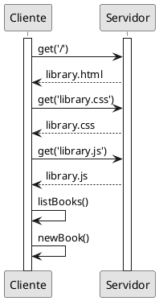

```plantuml
@startuml
!pragma teoz true
skinparam backgroundColor transparent
skinparam monochrome true

activate Cliente
activate Servidor

Cliente -> Servidor: get('/')
Cliente <-- Servidor: library.html
Cliente -> Servidor: get('library.css')
Cliente <-- Servidor: library.css
Cliente -> Servidor: get('library.js')
Cliente <-- Servidor: library.js
Cliente -> Cliente: listBooks()
Cliente -> Cliente: newBook()

'Arquitectura:
'Cliente P / L / D'
'Server D''

@enduml
```