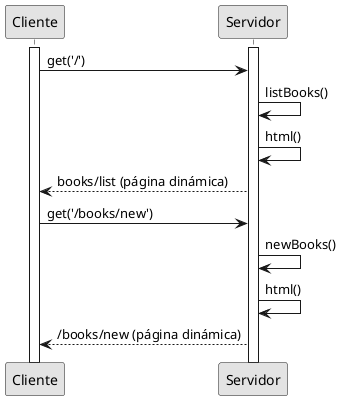

```plantuml
@startuml
!pragma teoz true
skinparam backgroundColor transparent
skinparam monochrome true

activate Cliente
activate Servidor

Cliente -> Servidor: get('/')
Servidor -> Servidor: listBooks()
Servidor -> Servidor: html()
Cliente <-- Servidor: books/list (página dinámica)
Cliente -> Servidor: get('/books/new')
Servidor -> Servidor: newBooks()
Servidor -> Servidor: html()
Cliente <-- Servidor: /books/new (página dinámica)

'Arquitectura:
'Cliente P /
'Server L / D

@enduml
```