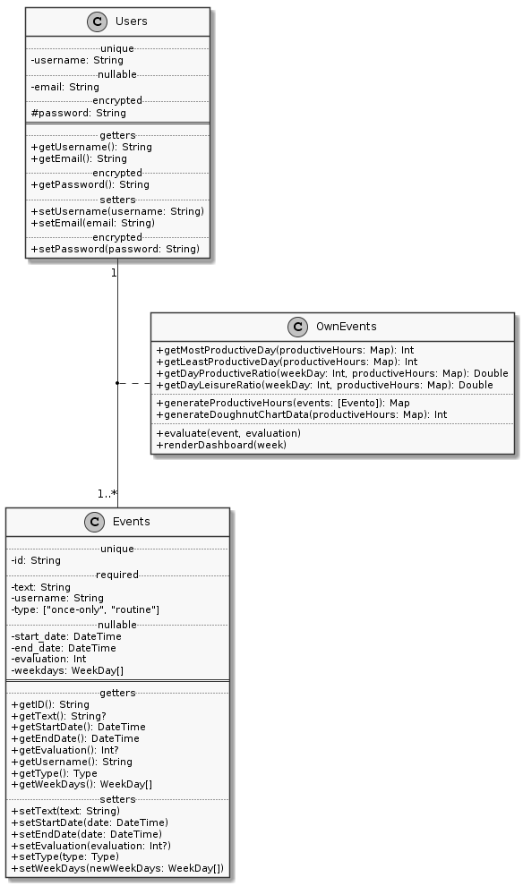

## Table of contents
- [Abstract](#abstract)
- [Goal](#goal)
- [Viability analysis](#viability-analysis)
- [Frameworks](#frameworks)
	- [Django (Python)](#django-python)
	- [Rails](#rails)
	- [Node.js](#nodejs)
- [Important considerations and technical specifications](#important-considerations-and-technical-specifications)
	- [Django](#django)
	- [Rails](#rails-1)
	- [Node.js](#nodejs-1)
- [Methodology](#methodology)
	- [Data model](#data-model)
- [Conclusion](#conclusion)
- [References](#references)

## Abstract

The current report will discuss the development process and choices required to build a web application whose objective is to help the general population to manage their time and to provide an overall view among the way they are spending their time. Throughout this project, three specific frameworks used to build web applications will be analyzed along with their respective scripting programming languages. The frameworks at issue are `Node.js` for `JavaScript`, `Django` for `Python` and `Rails` for `Ruby`. The analysis of these three alternatives will approach certain matters, such as the data model, software architecture, advantages and disadvantages for each framework and the required considerations when implementing the actual project over any of them.

## Goal

The plain objective of this analysis is to highlight the advantages, limitations and considerations about the Django, Node.js and Rails frameworks when it comes to build professional and in production web applications.

## Viability analysis

According to ITFirms, *Result of in-depth research and analysis*, in order to become a successful project, the development of this application must fulfill at least the following guidelines:

- **It must employ the right resources**. This implies to hire a set of professionists with the right skill-set required for the project and to assign them the correct task to perform according with their own capabilities and limitations. In order to fulfill this requirement, the company in charge of the application's implementation must be perceptive and select the correct engineers and arrogate the right milestone to each.

- **Select the appropiate development process**. In software engineering exists a wide variety of development process and each one of those includes benefits and drawbacks to consider. For developing this application is recommended the use of the SCRUM methodology. This recommendation arises from the fact that the encouraged increased communication for the *daily meetings* and *sprint reviews* will be healthy given the complex nature of a web application development.

- **Try making accurate estimations**. When the company decide the destined budget for the development of this application it must take into consideration not only the salaries their developers will need, but also the needful inversions for the computing power, bought of equipment and software and, of course, the estimated earnings that are expected from the application. Some recommended techniques to achieve this are the compute of *Critical times*, *Average profit* and *Break even point analysis*.

- **Define smaller milestones**. This is another of the reasons why the SCRUM methodology was suggested. According to ITFirms «mini-milestones deliver improved control, tractability and enhanced risk mitigation». Due to this fact the SCRUM's *sprints* of three weeks each will fit neatly this development.

- **Describe system architecture**. This step is actually being made throughout this whole essay, furthermore, despite the bundle of changes the company is free to perform, a solid base for this requirement is already being provided.

- **Elevate design**. Just like the previously mentioned bullet point, a preliminar and recommended version of a functional design is being provided passim over the current document.

- **Effective code application**. «Consuming smaller modules that are implicit, unit tested and uninterruptedly combined is a best practice that is used extensively» says ITFirms. And indeed, nowadays every single successfully on production software requires the effectuation of **Continuous integration - Continuous delivery - Continuous deployment (CI/CD)** practices. The execution of this high-level tecnhiques guarantee that the changes made by developers are merged into the main branch as often as possible and this changes are immediately validated, tested and integrated into the build if all the stages of the pipeline are approved. Then these changes are *«released to customers quickly in a sustainable way (...) only a failed test will prevent a new change to be deployed to production»*

Ergo, as long as the implementation of the application follow these heuristics that are already being attended along this report, the application should present acceptable profits without much of a trouble given the immediate need that it solves for quite a lot of the current human population.

## Frameworks

### Django

According to their official webpage, Django is defined as a *«high-level Python Web framework that encourages rapid development and clean, pragmatic design»*. They also state that the objective when programming on Django is to focus less on the *hassle of Web development* and more in writing the business logic of the application. The Django Software Foundation -main supporters of the Django project- specify as well that, along the framework advantages, take the spotlight the **velocity** with which developers might *«take applications from concept to completion»*, their **security** (helping developers *«avoid many common security mistakes»*) and their **scalability**.

Nevertheless, there are certain limitations within the framework that might be important to consider before choosing blindly to use this framework. Among them, highlights their increased interest in backwards compatibility, that is not a wrong choice on its own, but Django has proven that their efforts are far more focused on increasing compatibility than in enhancing more important features such as speed, one of the features that Django themselves call as one of their strongest features.

Another relatively negative implication of using Django is that their approaches of pushing the developer to build over given patterns make the applications implemented in Django too tightly-coupled, what leads to a monolithic application with no much of a chance of being modularized whatsoever.

### Rails
As per their official guide to get started, Rails is defined as «a web application development framework written in the Ruby programming language. It is  designed to make programming web applications easier by making assumptions about what every developer needs to get started». Rails performs said assumptions by assuming them as *«the best way to do things»* [sic] and encourages developers to take them. They conjecture that taking their patterns will increase the productivity of the developer, making otherwise will conflict with the very nature of the framework.

The Rails philosophy follows two main principles: *Don't Repeat Yourself*, just like Django and *Convention over Configuration*. The latter reflects the position that Rails takes with its "opinions" just as explained before. Rails is one of the greatest frameworks when it comes to velocity to getting things done. Some sources even claim that one might *«develop a web application at least ten times faster with Rails that with a typical Java framework»* 

### Node.js
Node.js is one of the most popular web frameworks nowadays existent. Amid their features, highlights the fact that it is an asynchronous event-driven framework. Its asynchronous nature helps to ensure that no deadlock is going to be presented. 

Unlike most web server frameworks, Node.js does not rely on Operative System threads. Instead, Node is somewhat of a single threaded system. Nonetheless, this name is more of a formality, since it does not actually works as a single thread. *«Node.js uses two kinds of threads: a main thread handled by **event loop** and several auxiliary threads in the **worker pool**»* states Maciej Cieślar. The *event loop* thread is what gives Node the single-threaded appearance, but it actually works by keeping the server in a sleep state until an event is registered. When an event occurs the event loop *«takes the callback and registers it to be executed at some point in the future»*. When those callbacks are registered, the *worker pool* spawns a separated thread to perform the task specified within the callback and return the result to the event loop; which continues its execution with said result.

This behavior allows Node to perform extremely well in **scalability** matters. Although it presents certain drawbacks, by instance, performing I/O or CPU-heavy demanding tasks will result in blocking the main (and only) thread, freezing the server in consequence. 

## Important considerations and technical specifications

### Django

When defining the design for the implementation to perform in Django the first thing in which it is going to differ from other implementations is over its preferred architectural pattern: *Model-Template-View* (MTV). This architectural pattern is defined by Django itself and corresponds to their own way of re-defining the Model-View-Controller pattern. For Django, the "view" tier corresponds more to *«which data you see, not how you see it»*, ergo, the *views* in Django corresponds to the *«callback functions called for a specific URL (…) because that callback function describes which data is presented»*. And for the "presentation" (as they call the way in which the data is presented) they prefer the term "template", which comes to be a delegate in charge of defining *how* the data is presented. This definition is presented by the Django Project in their Frequent Asked Questions section.

When working over the previously explained architectural pattern, it is also worth noting that the Model part in Django consists of an object-relational mapper that mediates data, models (say Python classes) and a relational database and the tier, normally known as Controller, is assumed by the framework itself.

The next consideration to take into account resides on the primary deployment platform of Django: Web Server Gateway Interface (WSGI). WSGI is, according to the official documentation of Django *«the Python standard for web servers and applications»*. The main issue raised by the use of this deployment platform roots from the fact that «WSGI-based servers cannot be utilized to develop real-time apps, as the WSGI protocol is synchronous. WSGI server can handle only one request at a time». This will implicate that the web server's thread is going to be kept locked until it receives a response.

### Rails

If the development process were to be implemented in Ruby on Rails the first matter to take into account are the conventions used by Rails by default. Starting with their application of the Model-View-Controller, where the Model in that framework performs an automatic map between a database table with a class written in the Ruby language. The Controller for Rails is the one in charge of responding to «external requests from the web server to the application, it usually requires to obtain some data from the models and pass this information to the views, just as one would expect from a Controller. As a matter of fact, the choices among the architectural pattern would be almost reduced to zero if programming in Ruby on Rails, given its principle CoC, most of the decisions would already be made for the developer.

The previous fact would conflict with the process in case the development team had some philosophies or patterns that they feel comfortable with and that do not correspond to the ones that Rails already chose for the project. If that case is present, then either the team would have to drop their own choices or to abandon Rails and opt for a more flexible framework.

Another fact to consider is the Embedded Ruby template library used by default to build the views. Embedded Ruby provides an easy and built-in way to programmatically control the format the data is presented with.

When creating an application, it is required to own some way to connect the database relations with instances that might be managed in memory. Rails offers Active Record as its ORM. Active Record ensures a swift set up to establish a connection with the persistence layer. The consideration arises when taking into account that this joint between domain logic and persistence will implicitly imply that objects and relations are too tightly-coupled with few chances to break them down and even if after some effort this is managed to be achieved that would also imply to sacrifice the built-in functionality provided by Rails. There is no middle point.

### Node.js
The first thing to consider when working with it is that Node.js is not an actual framework, but a runtime environment, so if the choice is to work with Node.js, the next decision would be among the diverse existing frameworks for Node.js, say Express.js, Meteor.js, Sails.js, etcetera.

When previously was presented the framework it was mentioned its weakness against heavy tasks. In case the application would grow until reach a point where the access to the database would involve a quite heavy labor it would be recommended to consider using the `worker_threads` module, which will provide a fully functional multithreaded paradigm within Node.js.

Another one of the main issues arised when using Node.js is the lack of a built-in ORM. This absence of support in such essential matters difficults the implementation of various basic tasks such as persistence, XML parsing, among others. This drawback must also be considered when analyzing the budget dedicated to the project if programmed in Node.js.

## Methodology
Independently from the framework that the company in charge of developing this project gets to choose based on the information provided in the present analysis, the following architectural structures are suggested:

First of all, the application must be designed to work for an architectural pattern of 3-tiers. This recommendation is a *must-have* for the current application, since the final user must be able to access the *Presentation* layer from the comfortability of their web browser. 

Then, the *Logic* layer must be established to respond and serve all the requests coming from the user throughout routes and HTTP requests. This layer, of course, must be implemented by using one of the previously described back-end scripting languages over the web server platform provided by the framework itself, say Django, Rails or Node.js.

Finally, the *Data* must be stored in a persistent server, say the ones provided by the Database Management System of choice by the company. It is highly recommended to use a relational database over a non-relational one since the data to process in the current application might be represented in its totality with structured data without losing any kind of valuable information. Once a relational schema is defined, then the ORM that the framework provides must be used to retrieve, process and update the records within the database based on the user interaction over instance objects mapped by the previously mentioned ORM.

### Data model
The application data to be stored persistently consist of not quite complex relationships of information. Among the data to be stored highlights the user-related information that will help the development team to focus the application to be user-centered in order to provide a more pleasant experience. Besides that, is also essential to keep persistently the information about the events that the users register. Aside from that information, everything else is calculable and the data model should not be cluttered with that kind of data. Ergo, the proposed data model looks as shown in the *Figure 1*.

## Conclusion
Depending on the expected market to be reached, the three of the here analyzed frameworks might be adequated for its use on the current project. If the web application is only intended to serve a counted amount of users from a local area, then Node.js is the best of the choices. Its lightweight, flexibility and scalability will result helpful in the development of the application. If the application is more intended to work for a national or metropolitan area, then the company might choose among Node.js because of its asynchronous nature that will provide a fluid interaction even at that scale; but Ruby on Rails would behaviour smoothly as well for that workload, besides it would include the added perks of the built-in functionality within the framework that would help the developers to complete the implementation quicker -as long as they follow *the rails way*-. Finally, if the project is aiming to get to be a global-class application, then Django will probably represent the best choice. Django's framework is solid and wide, it is not quite recommendable for small projects since the developer probably will end up with much more than needed.

It does not matter which final decision over framework the company choices for the actual implementation of this -and any other- project. They all will always imply underlying welfares and drawbacks, but it is important to be able to discernate which one of those is the more profitable depending on the current technical, financial, social, legal and environmental variables in which the company is currently found. 

## References
Django (Version 1.5) [Computer Software]. (2013). Retrieved from https://djangoproject.com.

Rails (Version 6.0.1) [Computer Software]. (2019). Retrieved from https://rubyonrails.org

Node.js (Version 12.13.0) [Computer Software]. (2016). Retrieved from https://nodejs.org/

Holovaty, A. and Kaplan-Moss, J. (2009). The Django Book. 2nd ed. Kansas. Ch. 5. Retrieved from https://web.archive.org/web/20160902130823/http://www.djangobook.com/en/2.0/chapter05.html#the-mtv-or-mvc-development-pattern

Top IT Firms - Result Of In-depth Research & Analysis. (2019). 8 Best Practices for Successful Software Development Projects - IT Firms. [online] Available at: https://www.itfirms.co/8-best-practices-for-successful-software-development-projects/ [Accessed 2 Dec. 2019].

Atlassian. (2019). Continuous integration vs. continuous delivery vs. continuous deployment. [online] Available at: https://www.atlassian.com/continuous-delivery/principles/continuous-integration-vs-delivery-vs-deployment [Accessed 2 Dec. 2019].

<!-- Django FAQ, why MTV? -->
Docs.djangoproject.com. (2019). FAQ: General | Django documentation | Django. [online] Available at: https://docs.djangoproject.com/en/3.0/faq/general/#why-does-this-project-exist [Accessed 2 Dec. 2019].

<!-- Django features and disadvantages -->
Datafloq.com. (2019). The Advantages And Disadvantages of Using Django. [online] Available at: https://datafloq.com/read/advantages-and-disadvantages-of-using-django/3050 [Accessed 2 Dec. 2019].

<!-- WSGI -->
Docs.djangoproject.com. (2019). How to deploy with WSGI | Django documentation | Django. [online] Available at: https://docs.djangoproject.com/en/3.0/howto/deployment/wsgi/ [Accessed 3 Dec. 2019].

Wsgi.readthedocs.io. (2019). WSGI — WSGI.org. [online] Available at: https://wsgi.readthedocs.io/en/latest/ [Accessed 3 Dec. 2019].

GitHub. (2019). Active Record. [online] Available at: https://github.com/rails/rails/tree/master/activerecord [Accessed 3 Dec. 2019].

Blog by Railsware. (2019). Python vs. Ruby vs. Node.js - Which Platform Is a Fit for Your Project?. [online] Available at: https://railsware.com/blog/python-vs-ruby-vs-node-js-which-platform-is-a-fit-for-your-project/ [Accessed 4 Dec. 2019].

LogRocket Blog. (2019). A complete guide to threads in Node.js - LogRocket Blog. [online] Available at: https://blog.logrocket.com/a-complete-guide-to-threads-in-node-js-4fa3898fe74f/ [Accessed 4 Dec. 2019].

LogRocket Blog. (2019). A complete guide to threads in Node.js - LogRocket Blog. [online] Available at: https://blog.logrocket.com/a-complete-guide-to-threads-in-node-js-4fa3898fe74f/ [Accessed 5 Dec. 2019].

MindInventory. (2019). The Advantages and Disadvantages of Node.js Web App Development. [online] Available at: https://www.mindinventory.com/blog/pros-and-cons-of-node-js-web-app-development/ [Accessed 5 Dec. 2019].
