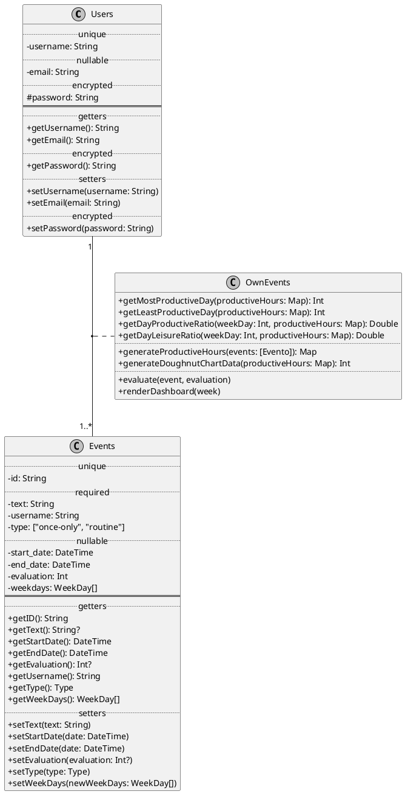

```plantuml
@startuml

' example | description
' - | -
'class01 <|-- Class02 | inheritance
'Class03 *-- Class04 | composition
'Class05 o-- Class06 | aggregation
'Class07 .. Class08 | dependency
'Class09 -- Class10 | asociation
!pragma teoz true
skinparam backgroundColor transparent
skinparam monochrome true
skinparam classAttributeIconSize 0

class Users {
	..unique..
	- username: String
	..nullable..
	- email: String
	....encrypted....
	# password: String
	==
	..getters..
	+ getUsername(): String    
	+ getEmail(): String
	..encrypted..
	+ getPassword(): String
	..setters..
	+ setUsername(username: String)
	+ setEmail(email: String)
	..encrypted..
	+ setPassword(password: String)
}

Users "1" -- "1..*" Events
(Users, Events) .. OwnEvents

class Events {
	..unique..
	- id: String
	..required..
	- text: String
	- username: String
	- type: ["once-only", "routine"]
	..nullable..
	- start_date: DateTime
	- end_date: DateTime
	- evaluation: Int
	- weekdays: WeekDay[]
	==
	..getters..
	+ getID(): String
	+ getText(): String?
	+ getStartDate(): DateTime
	+ getEndDate(): DateTime
	+ getEvaluation(): Int?
	+ getUsername(): String
	+ getType(): Type
	+ getWeekDays(): WeekDay[]
	..setters..
	+ setText(text: String)
	+ setStartDate(date: DateTime)
	+ setEndDate(date: DateTime)
	+ setEvaluation(evaluation: Int?)
	+ setType(type: Type)
	+ setWeekDays(newWeekDays: WeekDay[])
}

class OwnEvents {
	+ getMostProductiveDay(productiveHours: Map): Int
	+ getLeastProductiveDay(productiveHours: Map): Int
	+ getDayProductiveRatio(weekDay: Int, productiveHours: Map): Double
	+ getDayLeisureRatio(weekDay: Int, productiveHours: Map): Double
	..
	+ generateProductiveHours(events: [Evento]): Map
	+ generateDoughnutChartData(productiveHours: Map): Int
	..
	+ evaluate(event, evaluation)
	+ renderDashboard(week)
}	

@enduml
```