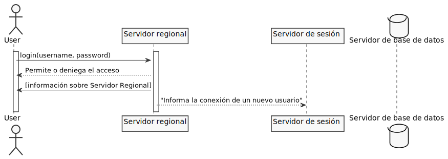

# Trabajo dirigido 1

## Hipótesis
- Router 
- Todo usuario que se une a una partida se encuentra en el mismo servidor de sesión

## Servidores 

### Servidor regional

- Se encarga de administrar a los usuarios más cercanos permitiendo o denegando el acceso -> permite iniciar sesión
- Redirecciona las siguientes solicitudes al servidor de sesión

### Servidor de sesión

- Existen cualquier cantidad de este tipo de servidores por cada zona geográfica en que el juego opera
- Mantiene el estado global del juego que se está llevando a cabo en ese servidor

### Servidor de base de datos
- Almacena la información de cada uno de los usuarios -avatar, rol, etc...-
- Almacena metadatos del juego

