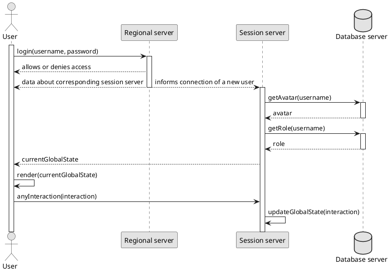

```plantuml
@startuml
    !pragma teoz true
    skinparam backgroundColor transparent
    skinparam monochrome true

    actor User
    participant "Regional server"
    participant "Session server"
    database "Database server"

    activate User

    User -> "Regional server" ++: login(username, password)
    User <-- "Regional server": allows or denies access
    
    User <-- "Regional server": data about corresponding session server
    & "Regional server" --> "Session server" ++ : informs connection of a new user
    deactivate "Regional server"

    "Session server" -> "Database server" ++: getAvatar(username)
    return avatar
    "Session server" -> "Database server" ++: getRole(username)
    return role

    User <-- "Session server": currentGlobalState
    User -> User: render(currentGlobalState)
    User -> "Session server": anyInteraction(interaction)
    "Session server" -> "Session server": updateGlobalState(interaction)
    

    

@enduml
```