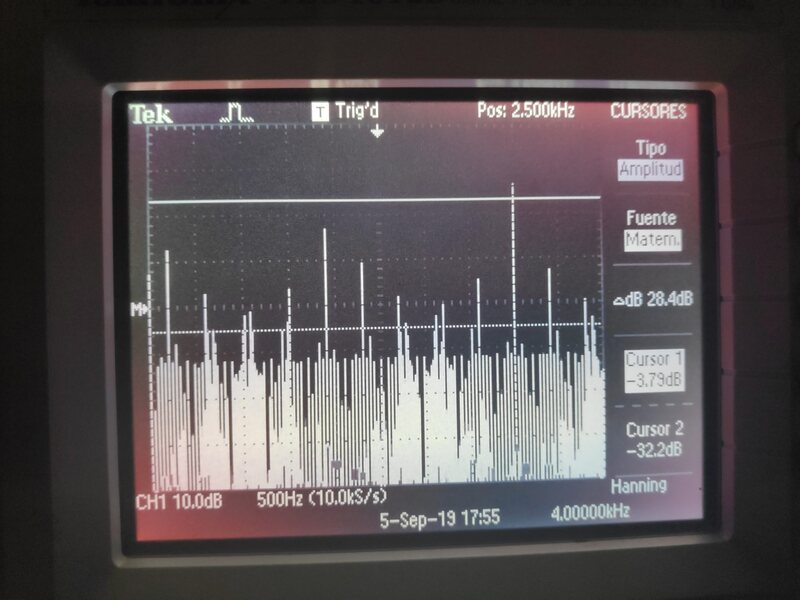

# Espectro magnético y Analizador de espectros

## Objetivo
Ubicar los rangos de frecuencias más usados en telecomunicaciones y visualizarlos en el equipo analizador de espectros.

## Resumen

## Análisis teórico

### Marco teórico

### Resultados experimentales
Reporte configuraciones y formas de onda observadas así como los rangos de operación de los equipos utilizados.
 Una descripción del uso del analizador de espectros así como todas las mediciones tomadas durante y después de la exposición del Instructor.

## Conclusión

---------------------------------------------------------------

## 1. Realice una investigación sobre los rangos de frecuencia del espectro electromagnético más usados en telecomunicaciones que incluya:

- Frecuencias de transmisión en AM.
- Frecuencias de transmisión en FM.
- Frecuencias de transmisión de TV.
- Frecuencias de transmisión satelital.
- Frecuencias de transmisión de aparatos domésticos.
- Frecuencias de transmisión de telefonía celular.
- Frecuencias de transmisión de otros sistemas de comunicación.
- Organismo gubernamental que regula la ocupación del espectro electromagnético en telecomunicaciones.

### Frecuencias de transmisión en AM

### Frecuencias de transmisión en FM

### Frecuencias de transmisión de TV

### Frecuencias de transmisión satelital

### Frecuencias de transmisión de aparatos doméstico

### Frecuencias de transmisión de telefonía celular

### Frecuencias de transmisión de otros sistemas de comunicación

### Organismo gubernamental que regula la ocupación del espectro electromagnético en telecomunicaciones

## 2. Con asesoría del instructor ajuste el generador de funciones Wave Station 2012 para generar una seña sinusoidal de 2Khz de frecuencia y amplitud 2v.

## 3. Visualice la señal en el osciloscopio de doble canal TDS202B.

## 4. Utilice la función matemática FFT para observar el espectro de frecuencias de la señal.

## 5. Modifique los parámetros de frecuencia y amplitud para obtener una señal  sinusoidal de 4Khz de frecuencia y amplitud de 1V. Observe los cambios en el dominio del tiempo y de la frecuencia.

## 6. Experimente con diferentes formas de onda: cuadrada, pulso y triangular, observe los cambios en el dominio del tiempo y de la frecuencia.

## 7. Con asesoría del instructor asimile el funcionamiento del analizador de espectros de alta frecuencia CXA 9000A considerando los siguientes elementos:
    • Rango de frecuencias de operación.
    • Ajuste y significado de SPAN.
    • Unidades de la escala horizontal
    • Ajuste y unidades de la escala vertical.
    • Localización y visualización de señales cableadas e inalámbricas.

## 8. Observe la generación de ondas con el generador de alta frecuencia Agilent N9310A.

## 9. Observe la generación de ondas con el generador de alta frecuencia Agilent N9310A.
