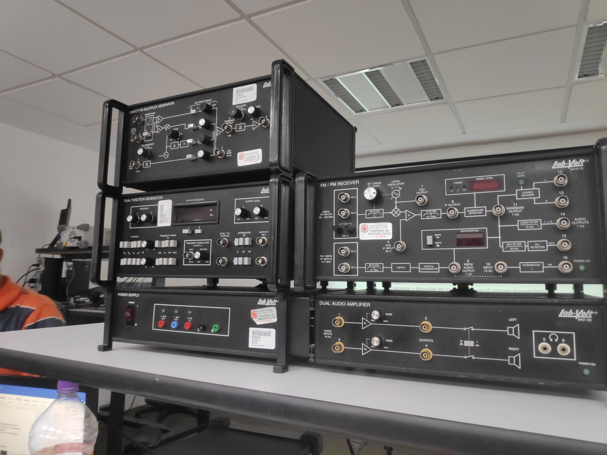
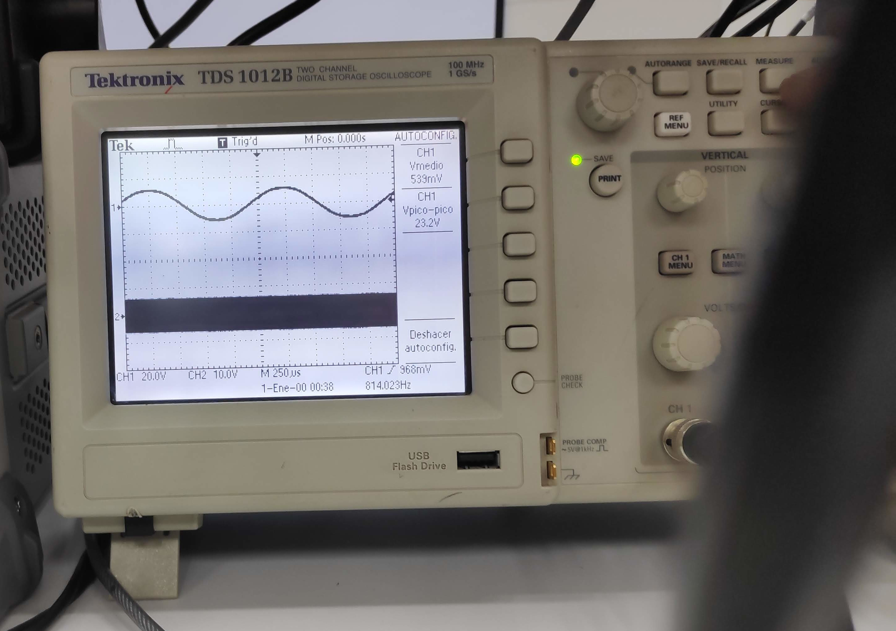
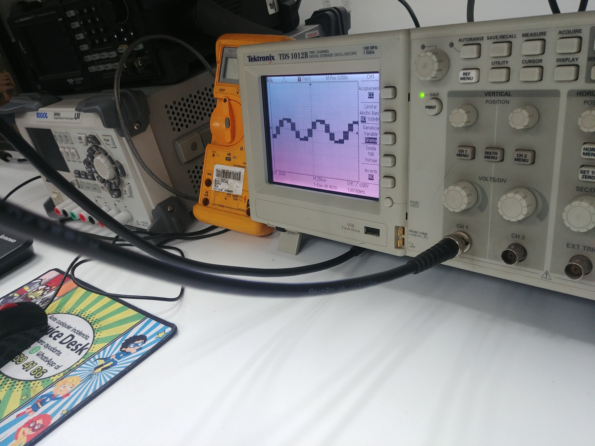
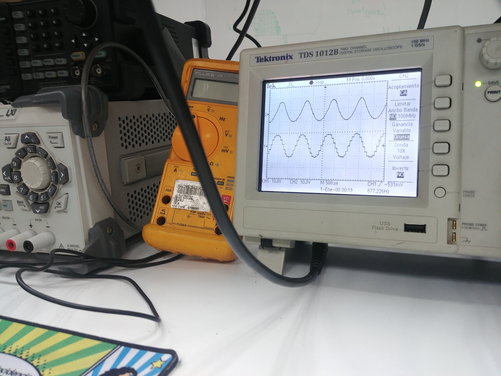

# Modulación de audio PCM 

## Tabla de contenidos
- [Modulación de audio PCM](#modulaci%c3%b3n-de-audio-pcm)
	- [Resumen](#resumen)
	- [Análisis teórico](#analysis)
		- [Marco teórico](#marco)
			- [Lado transmisor - codificación](#transmisor)
			- [Lado receptor - decodificación](#receptor)
		- [Resultados experimentales](#resultados-experimentales)
	- [Conclusión](#conclusion)
	- [Bibliografía](#biblio)

## Resumen
La presente práctica gira en torno a la conocida técnica de modulación *Pulse Code Modulation* que consiste en convertir una señal continua y analógica en un flujo de datos discretos y digitales mediante procedimientos de codificación como muestreo y cuantificación, así como procesos de decodificación y demodulación para obtener de vuelta la señal originalmente transmitida después de haber sido digitalizada. 

## Análisis teórico 

### Marco teórico 
PCM -abreviación de *Pulse Code Modulation*- es definido de acuerdo con la Biblioteca de Congreso de Colecciones (Library of Congress Collections) como:
> Tipo de codificación utilizado para flujos de bits de audio. Pulse code modulation fue originalmente desarollado (...) como un método para transmitir señales digitales sobre canales de comunicación análogos. La misma técnica probó ser efectiva como un método de muestreo y cuantificación de audio para su codificación en forma digital.  

PCM no es originalmente un formato con compresión, pero con el paso del tiempo algunas variantes de esta técnica fueron creadas, algunas de las cuales fueron modificadas para ser utilizadas principalmente en redes telefónicas públicas y privadas.

*Pulse code modulation* requiere como mínimo tres datos de entrada: una señal analógica, una frecuencia de muestreo y una cantidad (`n`) de bits. El primero de ellos, la señal analógica, debe de contener la información que se desea transmitir mediante esta técnica. La frecuencia de muestreo a su vez se refiere a un intervalo constante de tiempo en los que se tomará una *muestra* de la señal analógica previamente descrita. Finalmente, la cantidad de bits definirá el *tamaño de palabra* que será utilizado en la etapa de cuantificación que será explicada posteriormente. 

La funcionalidad de la técnica *Pulse code modulation* se divide en dos partes principales. La primera de ellas, **codificación**, es realizada por el transmisor, mientras que la segunda, **decodificación**, es llevada a cabo por el receptor.

#### Lado transmisor - codificación 
La *codificación* es el proceso de procurar convertir una señal analógica continua en un flujo de datos discretos digitales. Esta es separada a su vez en dos procesos llamados *muestreo* y *cuantificación*. El **muestreo** se refiere al proceso de obtener una serie de muestras de la señal analógica original en cada momento del intervalo en que la frecuencia de muestreo lo indique.  

El segundo paso para alcanzar este objetivo es llamado **cuantificación**; el cual consiste en asociar cada muestra obtenida en el proceso anterior con un número binario de `n-bits`, donde `n` corresponde al número de bits explicado previamente. De esta manera, si `n` es elegido como `4` cada muestra será asignada a uno entre `2^4=16` palabras posibles entre las que es dividida la amplitud de la señal original y se es asignada el valor más cercano. De esta manera es completamente discretizada la señal una vez continua.

Para completar la digitalización simplemente se concatenan las palabras conseguidas una vez completados los dos procesos anteriores para generar un flujo de bits al que se le pueden aplicar todas las operaciones digitales que sean prudentes o necesarias. Es importante mencionar que entre más bits sean utilizados en la etapa de cuantificación, más fiel será la representación discreta de la señal analógica. La frecuencia de muestreo también 

#### Lado receptor - decodificación 
Después de que la información modulada ha sido enviada, el receptor recibirá una cadena de bits donde cada `n` bits representa dato muestreado de la señal original. Para conseguir de vuelta la información original es necesario hacer una **demodulación** esta información. Este proceso consiste partiendo el flujo de bits utilizando la longitud de palabra con la que se cuantificó en primer lugar. Una vez que se obtienen las palabras se organizan de acuerdo con el nivel que su número binario indica para formar nuevamente una señal pseudo-sinusoidal. Finalmente, suele ser aplicado un filtro que suaviza la señal para difuminar los picos que son generados como resultado natural de la digitalización.

### Resultados experimentales
Para llevar este experimento a la práctica, fueron requeridos algunos instrumentos y aparatos, entre ellos se encuentra:
- Fuente de telecomunicaciones de LabVolt.
- Rack para módulos de codificación. 
- Módulo PCM Encoder
- Módulo PCM Decoder.
- Módulo Low Pass Filter
- Modulo Dual Function generator.
- Cables BNC-BNC

<figure>
	
	<figcaption><em>Material necesario</em></figcaption>
</figure>

El proceso llevado a cabo para realizar esta práctica se realizó como sigue: 

1. Se conecta un cable coaxial con candado desde el Generador de Funciones (*Dual function generator*) al Osciloscopio para realizar una previsualización de la señal a generar
2. El Generador de Funciones es ajustado para crear y transmitir una señal de 1 kilohertz
	<figure>
		
		<figcaption><em>Figura 2. Señal original a transmitir en el canal 1. Señal de muestreo en el canal 2.</em></figcaption>
	</figure>
3. Se conecta entonces el Generador de Funciones al Codificador de Pulse Code Modulation
4. En otro canal del Generador se generará también una señal de muestreo configurada en este caso a 10 KHz. Esta señal también puede ser visualizada en la *Figura 2*.
5. Ambas señales son enviadas desde el Generador hacia el Modulador de PCM
6. El Modulador se encarga entonces de realizar el muestreo y cuantificación de las señales
   <figure>
	   
	   <figcaption><em>Figura 3. Señal durante el proceso de digitalización</em></figcaption>
   </figure>
7. Una vez que la señal ya ha sido codificada es entonces enviada desde el Codificador (Modulador) al Decodificador de PCM
8. La señal decodificada es entonces desplegada en el mismo osciloscopio, en donde es posible observar que la señal toma la forma aproximadamente original, pero se pueden observar los muestreos y la hacen parecer una escalera, en lugar de una señal sinusoidal
   <figure>
	   
	   <figcaption><em>Figura 4. Señal durante el proceso de decodificación. Antes (abajo) y después (arriba) del filtro</em></figcaption>
   </figure>
9.  Finalmente, es aplicado un filtro de pasa-bajas (*Low Pass Filter*) que permitirá suavizar la imagen de tal manera que la señal luzca mucho más asemejada a la original. Esta comparación también puede verse en la *Figura 4*.

## Conclusión 
La técnica de Pulse Code Modulation representa una de las ténicas más importantes de transmisión de datos analógicos por vías digitales. Dado que es posible realizarse con circuitería de bajo costo, es ampliamente utilizado en comunicaciones digitales ya que permite la mezcla y transmisión de datos de diferentes fuentes, según clarifica Luis Chaparro (2015). Además, mantiene su utilidad en largas distancias mediante el uso de repetidores, lo cual incrementa las capacidades de esta técnica. Gracias a su naturaleza analógica -> digital y su algoritmo de modulación y demodulación tan directo, resulta una gran técnica para comprender la funcionalidad de las comunicaciones digitales.

## Bibliografía 
- Loc.gov. (2019). PCM, Pulse Code Modulated Audio. [online] Available at: https://www.loc.gov/preservation/digital/formats/fdd/fdd000016.shtml [Accessed 30 Oct. 2019].
- Chaparro, L. and Akan, A. (n.d.). Signals and systems using MATLAB.