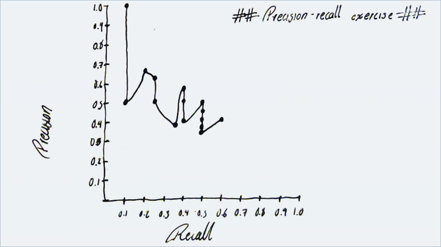

# Precision-recall average exercise

## Query 1

**R1** = `{ D3, D5, D9, D25, D39, D44, D56, D71, D89, D123 }`

| Order  | Precision | Recall |
| ------ | --------- | ------ |
| * D123 | 1/1       | 1/10   |
| - D84  | 1/2       | 1/10   |
| * D56  | 2/3       | 2/10   |
| - D6   | 2/4       | 2/10   |
| - D8   | 2/5       | 2/10   |
| * D9   | 3/6       | 3/10   |
| - D511 | 3/7       | 3/10   |
| - D129 | 3/8       | 3/10   |
| - D187 | 3/9       | 3/10   |
| * D25  | 4/10      | 4/10   |
| - D38  | 4/11      | 4/10   |
| - D48  | 4/12      | 4/10   |
| - D250 | 4/13      | 4/10   |
| - D113 | 4/14      | 4/10   |
| * D3   | 5/15      | 5/10   |

---
## Query 2

**R2** = `{ D3, D5, D9, D25, D39, D44, D56, D71, D89, D123 }`
| Order  | Precision | Recall |
| ------ | --------- | ------ |
| * D123 | 1/1       | 1/10   |
| - D84  | 1/2       | 1/10   |
| * D39  | 2/3       | 2/10   |
| * D9   | 3/4       | 3/10   |
| - D8   | 3/5       | 3/10   |
| * D71  | 4/6       | 4/10   |
| * D44  | 5/7       | 5/10   |
| - D129 | 5/8       | 5/10   |
| - D187 | 5/9       | 5/10   |
| * D25  | 6/10      | 6/10   |
| - D38  | 6/11      | 6/10   |
| - D48  | 6/12      | 6/10   |
| - D250 | 6/13      | 6/10   |
| - D113 | 6/14      | 6/10   |
| * D3   | 7/15      | 7/10   |

## Precision and recalls summarize

| Precision Q1      | Recall Q1    | Precision Q2      | Recall Q2    |
| ----------------- | ------------ | ----------------- | ------------ |
| 1/1=**1**         | 1/10=**0.1** | 1/1=**1**         | 1/10=**0.1** |
| 1/2=**0.5**       | 1/10=**0.1** | 1/2=**0.5**       | 1/10=**0.1** |
| 2/3=**0.666667**  | 2/10=**0.2** | 2/3=**0.666667**  | 2/10=**0.2** |
| 2/4=**0.5**       | 2/10=**0.2** | 3/4=**0.75**      | 3/10=**0.3** |
| 2/5=**0.4**       | 2/10=**0.2** | 3/5=**0.6**       | 3/10=**0.3** |
| 3/6=**0.5**       | 3/10=**0.3** | 4/6=**0.666667**  | 4/10=**0.4** |
| 3/7=**0.428571**  | 3/10=**0.3** | 5/7=**0.714286**  | 5/10=**0.5** |
| 3/8=**0.375**     | 3/10=**0.3** | 5/8=**0.625**     | 5/10=**0.5** |
| 3/9=**0.333333**  | 3/10=**0.3** | 5/9=**0.555556**  | 5/10=**0.5** |
| 4/10=**0.4**      | 4/10=**0.4** | 6/10=**0.6**      | 6/10=**0.6** |
| 4/11=**0.363636** | 4/10=**0.4** | 6/11=**0.545455** | 6/10=**0.6** |
| 4/12=**0.333333** | 4/10=**0.4** | 6/12=**0.5**      | 6/10=**0.6** |
| 4/13=**0.307692** | 4/10=**0.4** | 6/13=**0.461538** | 6/10=**0.6** |
| 4/14=**0.285714** | 4/10=**0.4** | 6/14=**0.428571** | 6/10=**0.6** |
| 5/15=**0.333333** | 5/10=**0.5** | 7/15=**0.466667** | 7/10=**0.7** | = |

## Precision and recall averages

| Average Precision | Average Recall |
| ----------------- | -------------- |
| 1/1=**1**         | 1/10=**0.1**       |
| 1/2=**0.5**       | 1/10=**0.1**       |
| 2/3=**0.666667**  | 1/5=**0.2**        |
| 5/8=**0.625**     | 1/4=**0.25**       |
| 1/2=**0.5**       | 1/4=**0.25**       |
| 7/12=**0.583333** | 7/20=**0.35**      |
| 4/7=**0.571429**  | 2/5=**0.4**        |
| 1/2=**0.5**       | 2/5=**0.4**        |
| 4/9=**0.444444**  | 2/5=**0.4**        |
| 1/2=**0.5**       | 1/2=**0.5**        |
| 5/11=**0.454545** | 1/2=**0.5**        |
| 5/12=**0.416667** | 1/2=**0.5**        |
| 5/13=**0.384615** | 1/2=**0.5**        |
| 5/14=**0.357143** | 1/2=**0.5**        |
| 2/5=**0.4**       | 3/5=**0.6**        |

## Averages' graph:

