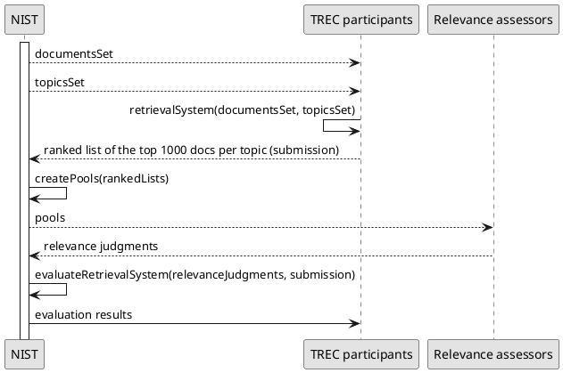

```plantuml
@startuml
    !pragma teoz true
    skinparam backgroundColor transparent
    skinparam monochrome true
    participant NIST
    participant "TREC participants"

    activate NIST

    NIST --> "TREC participants": documentsSet
    NIST --> "TREC participants": topicsSet
    "TREC participants" <- "TREC participants": retrievalSystem(documentsSet, topicsSet)
    NIST <-- "TREC participants": ranked list of the top 1000 docs per topic (submission)
    NIST -> NIST: createPools(rankedLists)
    NIST --> "Relevance assessors": pools
    NIST <-- "Relevance assessors": relevance judgments
    NIST -> NIST: evaluateRetrievalSystem(relevanceJudgments, submission)
    NIST -> "TREC participants": evaluation results

@enduml
```