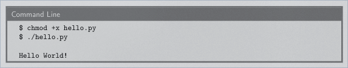
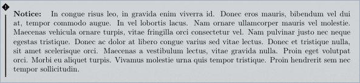

# Some code snippets used in Mireya's template:

## Equations

    % Math equation/formula
    \begin{equation}
        I = \int_{a}^{b} f(x) \; \text{d}x.
    \end{equation}

## Information boxes

    \begin{info} % Information block
        This is an interesting piece of information, to which the reader should pay special attention. Fusce varius orci ac magna dapibus porttitor. In tempor leo a neque bibendum sollicitudin. Nulla pretium fermentum nisi, eget sodales magna facilisis eu. Praesent aliquet nulla ut bibendum lacinia. Donec vel mauris vulputate, commodo ligula ut, egestas orci. Suspendisse commodo odio sed hendrerit lobortis. Donec finibus eros erat, vel ornare enim mattis et.
    \end{info}

## Questions

    % Numbered question, with subquestions in an enumerate environment
    \begin{question}[\itshape (with optional title)]
        Quisque ullamcorper placerat ipsum. Cras nibh. Morbi vel justo vitae lacus tincidunt ultrices. Lorem ipsum dolor sit amet, consectetuer adipiscing elit.

        % Subquestions numbered with letters
        \begin{enumerate}[(a)]
            \item Do this.
            \item Do that.
            \item Do something else.
        \end{enumerate}
    \end{question}
        

## Algorithms

    \begin{center}
        \begin{minipage}{0.5\linewidth} % Adjust the minipage width to accomodate for the length of algorithm lines
            \begin{algorithm}[H]
                \KwIn{$(a, b)$, two floating-point numbers}  % Algorithm inputs
                \KwResult{$(c, d)$, such that $a+b = c + d$} % Algorithm outputs/results
                \medskip
                \If{$\vert b\vert > \vert a\vert$}{
                    exchange $a$ and $b$ \;
                }
                $c \leftarrow a + b$ \;
                $z \leftarrow c - a$ \;
                $d \leftarrow b - z$ \;
                {\bf return} $(c,d)$ \;
                \caption{\texttt{FastTwoSum}} % Algorithm name
                \label{alg:fastTwoSum}   % optional label to refer to
            \end{algorithm}
        \end{minipage}
    \end{center}

## File content

    % File contents
    \begin{file}[hello.py]
    \begin{lstlisting}[language=Python]
    #! /usr/bin/python

    import sys
    sys.stdout.write("Hello World!\n")
    \end{lstlisting}
    \end{file}

## Command lines execution

    % Command-line "screenshot"
    \begin{commandline}
        \begin{verbatim}
            $ chmod +x hello.py
            $ ./hello.py

            Hello World!
        \end{verbatim}
    \end{commandline}

## Warnings

    % Warning text, with a custom title
    \begin{warn}[Notice:]
    In congue risus leo, in gravida enim viverra id. Donec eros mauris, bibendum vel dui at, tempor commodo augue. In vel lobortis lacus. Nam ornare ullamcorper mauris vel molestie. Maecenas vehicula ornare turpis, vitae fringilla orci consectetur vel. Nam pulvinar justo nec neque egestas tristique. Donec ac dolor at libero congue varius sed vitae lectus. Donec et tristique nulla, sit amet scelerisque orci. Maecenas a vestibulum lectus, vitae gravida nulla. Proin eget volutpat orci. Morbi eu aliquet turpis. Vivamus molestie urna quis tempor tristique. Proin hendrerit sem nec tempor sollicitudin.
    \end{warn}

