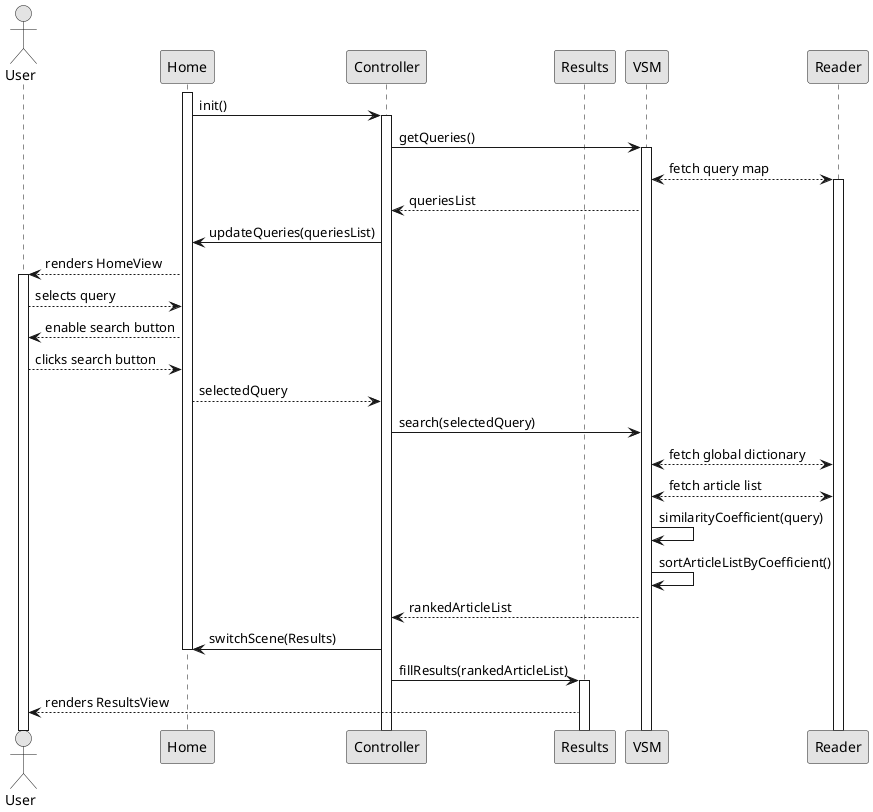
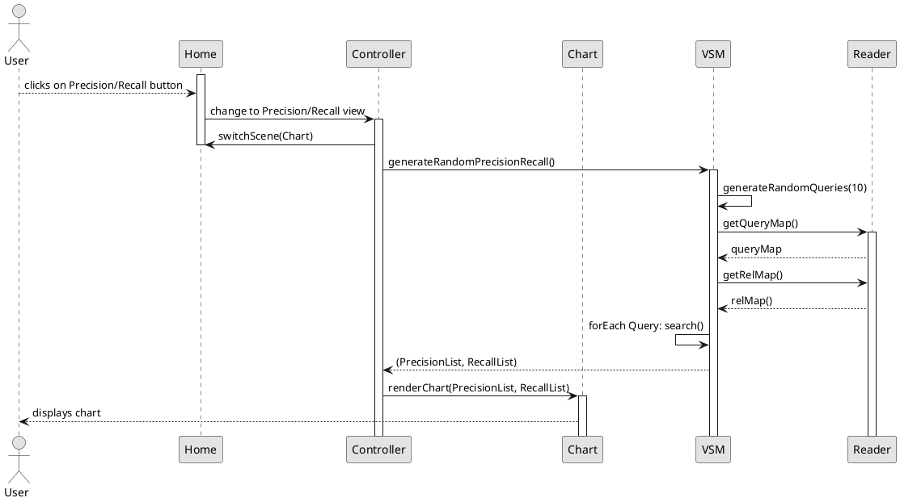

```plantuml
@startuml
!pragma teoz true
skinparam backgroundColor transparent
skinparam monochrome true
actor User 

activate Home

Home -> Controller++: init()
participant Results
Controller -> VSM++: getQueries()
VSM <--> Reader++: fetch query map
VSM --> Controller: queriesList
Controller -> Home: updateQueries(queriesList)
User <-- Home++: renders HomeView
User --> Home: selects query
User <-- Home: enable search button
User --> Home: clicks search button
Home --> Controller: selectedQuery
Controller -> VSM: search(selectedQuery)
VSM <--> Reader: fetch global dictionary
VSM <--> Reader: fetch article list
VSM -> VSM: similarityCoefficient(query)
VSM -> VSM: sortArticleListByCoefficient()
VSM --> Controller: rankedArticleList
Home <- Controller: switchScene(Results)
deactivate Home
Controller -> Results++: fillResults(rankedArticleList)
Results --> User: renders ResultsView

@enduml
```

```plantuml
@startuml
!pragma teoz true
skinparam backgroundColor transparent
skinparam monochrome true

actor User
participant Home
participant Controller
participant Chart
participant VSM
participant Reader

activate Home

User --> Home: clicks on Precision/Recall button
Home -> Controller ++: change to Precision/Recall view
Controller -> Home: switchScene(Chart)
deactivate Home
Controller -> VSM ++: generateRandomPrecisionRecall()
VSM -> VSM: generateRandomQueries(10)
VSM -> Reader ++: getQueryMap()
VSM <-- Reader: queryMap
VSM -> Reader: getRelMap()
VSM <-- Reader: relMap()
VSM <- VSM: forEach Query: search()
Controller <-- VSM: (PrecisionList, RecallList)
Controller -> Chart ++: renderChart(PrecisionList, RecallList)
Chart --> User: displays chart

@enduml
```