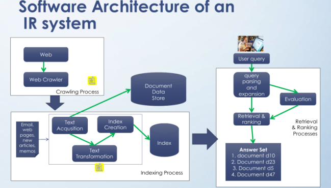
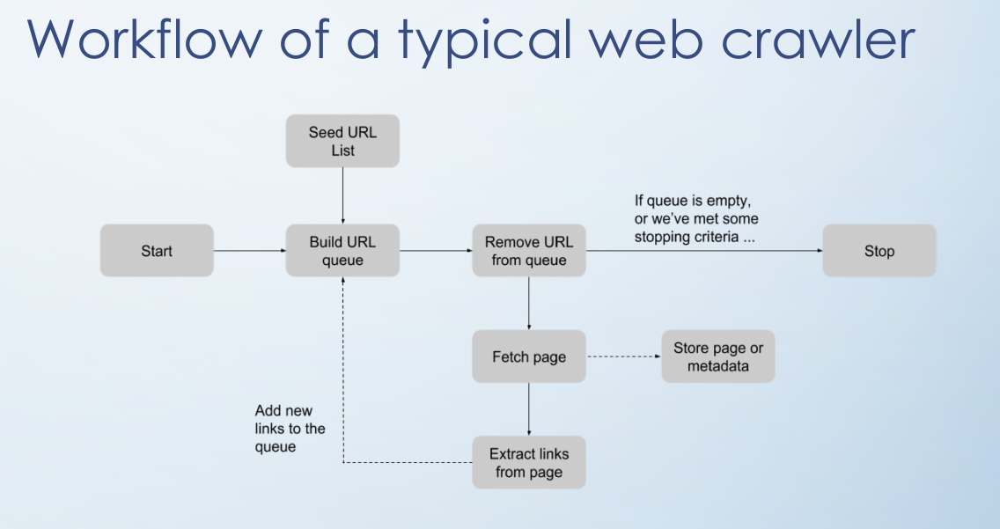
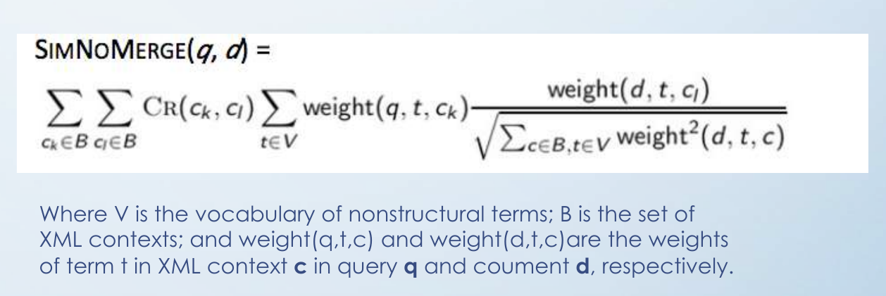

## Big issues
- **Relevance** - A relevant document contains the information that a person was looking for when they submitted a query to the search engine.
  - Topic relevance - A text document is topically relevant to a query if it is on the same topic
  - User relevance - The document is relevant only if it matches the user specific needs, say place, time, topic, origin, language, personal beliefs...
- **Evaluation** - how well it matches a person's expectations
  - Emphasis on information needs
- **Information need** - The underlying cause of the query that a person submits to a search engine.

**Test collection** - Collection of text documents, queries and the list of relevant documents for each query.

A retrieval model is a formal representation of the process of
matching a query and a document. It is the basis of the ranking algorithm that is
used in a search engine to produce the ranked list of documents. A good retrieval
model will find documents that are likely to be considered relevant by the person
who submitted the query. Some retrieval models focus on topical relevance, but
a search engine deployed in a real environment must use ranking algorithms that
incorporate user relevance.

*«Precision is the proportion of retrieved documents that are relevant»*
*«Recall is the proportion of relevant documents that are retrieved»*
	
## Architecture of a search engine

- Indexing process: Builds the structures that enable searching
   - Text acquisition
      - Crawling
      - Feeds
      - Conversion
      - Document data store
   - Text transformation
      - Parsing
      - Stopping
      - Stemming
      - Link extraction and analysis
      - Information extraction
      - Classifier
   - Index creation
      - Document statistics
      - Weighting
      - Inversion
      - Index distribution
- Query process: Uses those structures and a person's query to produce a ranked list of documents.
   - User insteraction
      - Query input
      - Query transformation
      - Results output
   - Ranking
      - Scoring
      - Performance optimization
      - Distribution
   - Evaluation
      - Logging
      - Ranking analysis
      - Performance analysis

## Crawling

### Challenges
- Size of the internet
- Constant movement - what's relevant today might not be tomorrow
- Storage space
- Constantly downloading new content

## Feeds
Once a page has visited is marked as fresh, but it is required to re-visit again (binary metric- it is fresh or not)
*A page is fresh if the crawler has the most recent copy of that page, stale otherwise*

**Age** is a metric to determine how much time has ocurred since the page changed from the last time it was synced

## Text processing
The trend in IR systems over time has been from standard use of quite large stop lists to very small stop lists to non stop list.

Web search engines generally do not require stop lists because they focus on statistics

**Normalization:** It is the process of canonicalizing tokens so that matches occur despite superficial diferences. -> `USA == U.S.A.`

**Stemming:** A crude heuristic process that chops off the ends of words -> `{organize, organizes, organizing} -> organiz`

**Lemmatization:** Aims to remove inflectional endings only and return the base -> `{am, are, is} -> to be`

## XML Retrieval

Useful for queries with both textual and structural criteria.

`Path == XML context`

### Challenges

1. **What to retrieve?** Users do not expect full documents
2. **Indexing units.** To index by leaves? Largest elements? Every single element?
3. **Nested elements.** Nested elements are usually not useful. Discard if so (users don't care, assesors don't judge them relevant)

### VSM

**Dimensions of a vector:** vocabulary terms -> lexicalized trees

**Lexicalized tree**: to split an XML doc into each possibly path (context) without overlapping

**Context resemble:** used to measure similarity between a *query* and a *context*

	CR(c_q, c_d) = c_q matches c_d ? (1 + |c_q|) / (1 + |c_d|) : 0

The **query** ***matches*** the **context** if you may turn the former into the latter by inserting additional nodes.

For the final score of a document it is used the huge function of `SimNoMerge(q, d)`

**CAS:** contain explicit references to the XML structure. Limit the context to be retrieved.

**CO:** do not consider structure. It is a challenge because any element might be prone to be retrieved if it fulfills the query

### Component coverage
- (E)xact coverage
- Too (S)mall coverage
- Too (L)arge coverage
- (N)o coverage

### Topical relevance
0. Nonrelevant
1. Marginally relevant
2. Fairly relevant
3. Highly relevant

**2S** -> ***fairly relevant** component that is **too small***

**3E** -> ***highly relevant** component with **exact coverage***

## Text classification

*Organization of information for better understanding and interpretations of data*

### Machine learning

Algorithms that **learn patterns** and use them to **make predictions**.

#### Types of machine learning algorithms
1. Supervised learning -> it is provided labeled information and a function to learn from it.
2. Unsupervised learning -> no training data is provided.
3. Combines a fraction of labeled and unlabeled data

### Unsupervised algorithms

1. Clustering
It means to group a given set of data points into *clusters* by assigning each point to one of them, where points in each cluster are similar and points among clusters are dissimilar.

#### K-means

This is an iterative algorithm for group $N$ points into $k$ clusters

***In:***
- $k$ a set of clusters
- $N$ data points

***Out:***
The $N$ data points assigned to the $k$ clusters

The algorithm works as follows:

1. The $k$ centroids are placed randomly among the data points
2. Each data point is assigned to its *closest* centroid
3. The centroids are updated by moving them to the *mean* of the points in its group.
4. Repeat 2. and 3. until a designed condition is fulfilled 

#### Naive text classification

This method tries to assign each of the given documents to a labeled class based on the match of its terms.

***In:***
- $D$ a collection of documents
- $C$ a collection of classes with their labels 

1. Represent the documents and classes as *weighted term* vectors with the VSM method
2. For each pair of (d, c) calculate its similitude with the formula:
$sim(d, c)= (d · c)/(||d|| × ||c||)
3. Assign to $d$ the $c$ with the highest similitude

