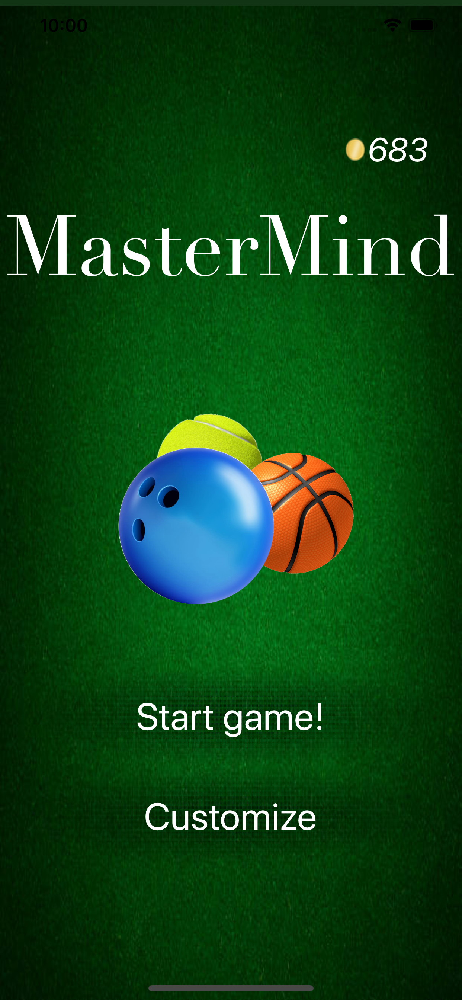
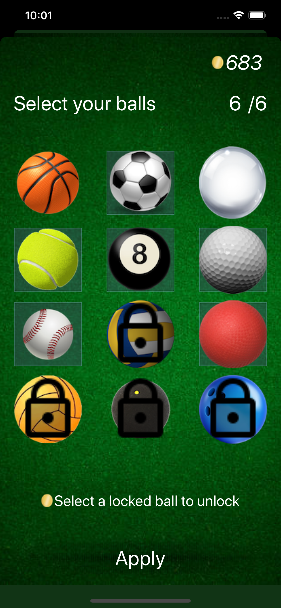
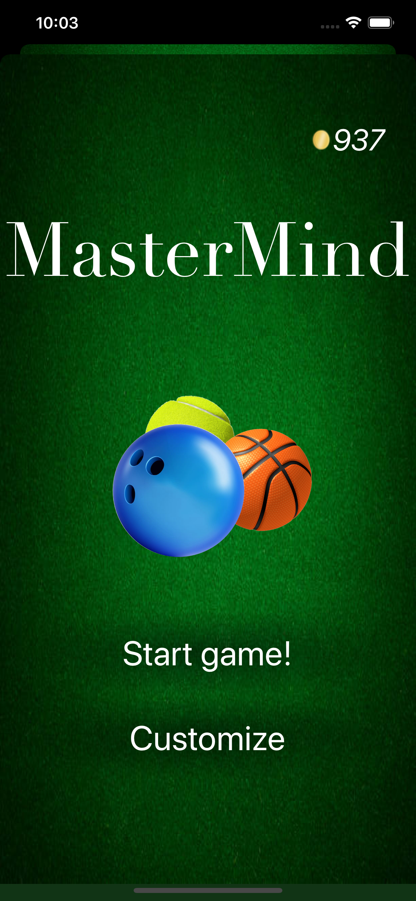
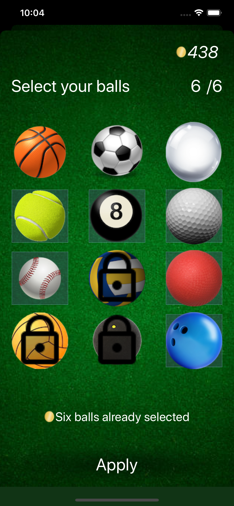

# Juego Mastermind para iOS

## Necesidad del proyecto
El presente proyecto fue elaborado debido a la creciente necesidad de los usuarios de teléfonos inteligentes por entretenimiento. De acuerdo con Google y TechJury el 91 % de los usuarios de *smartphones* suelen invertir aproximadamente 43 % de su tiempo tras una pantalla en aplicaciones de ocio y entretenimiento. La presente aplicación pretende proveer a sus usuarios con una cantidad ilimitada de horas de entretenimiento sano al proveer una aplicación ligera, responsiva, centrada en el usuario, intuitiva y fácil de utilizar.

El juego en cuestión, Master Mind, o «mente maestra» en español, es un juego de estrategia cuyo objetivo es estimular el pensamiento lógico, la capacidad analítica y el ingenio de los jugadores, mas al mismo tiempo proporciona diversión y entretenimiento al atrapar la atención del usuario y no soltarla hasta que es capaz de decifrar el enigma actual.

La jugabilidad de la presente aplicación consiste en que la aplicación genera un código aleatorio de cuatro balones propios de distintos deportes o actividades recreativas donde pueden existir cualquier cantidad de repetidos. El usuario tendrá ocho intentos disponibles para averiguar el enigma que la computadora ha generado para esa instancia de juego. Durante cada intento el usuario podrá elegir cuatro balones a su voluntad y el juego le proporcionará pistas que le permitirán al jugador deducir la certeza o vaguedad de su intento. Las pistas en cuestión pueden ser de dos tipos:

- Un botón dorado significa que uno de los balones que el usuario ha introducido es del deporte correcto y está en la posición correcta
- Un botón plateado significa que uno de los balones es del tipo correcto pero se encuentra en una posición inadecuada

Con estas pistas, el usuario debe conseguir relacionar sus múltiples intentos junto con las pistas provistas para averiguar el código escondido. El jugador gana si consigue adivinar la secuencia y pierde si termina sus intentos sin haber descubierto el enigma. El juego proveerá con una moneda del juego al usuario con base en su desempeño y el usuario podrá utilizar esta moneda para adquirir nuevos balones representativos de otros deportes.

## Diseño de la interfaz gráfica
Debido a su naturaleza, la interfaz de la aplicación debe de ser capaz de cambiar dinámicamente de acuerdo con las decisiones del usuario. Por esta razón, la aplicación no podría ser diseñada de manera completamente estática. Para alcanzar este comportamiento sólo fueron diseñados el formato con que los elementos visuales deben desplegarse y el tipo de información que estos contendrán. 

Ya que dentro del juego mismo se tendría que lidiar con una cantidad muy amplia de elementos que controlar dependiendo de la lógica del juego, resultaba una tarea muy tediosa y poco mantenible crear manualmente referencias a cada uno de ellos. Por esta razón, únicamente se crearon `IBOutlet`s de los contenedores y las referencias a los elementos que se encontraban dentro de ellos fueron obtenidas programáticamente para poder ser manipuladas a voluntad.

De la misma manera, cada uno de esos elementos necesitaba poseer interacción con el usuario y resultaría, nuevamente, poco mantenible forzar la interacción con el método que debían realizar de manera directa, así que estos fueron proporcionados también de manera dinámica exponiendo los métodos necesarios a que se compilaran de manera explícita de la forma que el código legado de *Objective C* mediante la anotación `@objc`. Posteriormente, esos métodos serían asignados como *selectores* dentro de ciertos `UIGestureRecognizer`.

## Screenshots

A continuación, se muestran las capturas de pantalla del juego funcional en ejecución.

<figure>
	
	<figcaption><em>Pantalla principal del juego. Usuario con 683 monedas</em></figcaption>
</figure>
<figure>
	
	<figcaption><em>Vista para personalizar los balones con los que jugará el usuario.
	Se eligen soccer, tenis, billar, golf, beisbol y quemados</em></figcaption>
</figure>
<figure>
	
	<figcaption><em>Vista de un juego nuevo. Los balones para seleccionar (abajo) son los mismos que se eligieron en la imagen anterior</em></figcaption>
</figure>
<figure>
	
	<figcaption><em>El usuario hace un intento y obtiene dos botones plateados. Se muestra el momento antes de confirmar el segundo intento. Nótese la confirmación en donde se colocarán las pistas</em></figcaption>
</figure>
<figure>
	
	<figcaption><em>Una vez confirmado el intento anterior el usuario recibe dos botones dorados y un plateado</em></figcaption>
</figure>
<figure>
	
	<figcaption><em>Después de varios intentos, el usuario adivina el enigma en el intento 7. Nótese que el patrón en la parte superior (enigma) coincide con el último intento del usuario y nótense los 254 monedas que se le darán al usuario por ese juego</em></figcaption>
</figure>
<figure>
	
	<figcaption><em>De vuelta a la pantalla principal, el usuario ahora tiene las 683 monedas iniciales más las 254 que acaba de ganar</em></figcaption>
</figure>
<figure>
	
	<figcaption><em>En esta nueva instancia del juego, el usuario trató de hacer un patrón bonito y en consecuencia perdió la partida. Únicamente recibe una moneda (3 por cada botón dorado menos 5 por perder)</em></figcaption>
</figure>
<figure>
	
	<figcaption><em>Pantalla de personalización que muestra el total de monedas y las cuatro esferas bloqueadas</em></figcaption>
</figure>
<figure>
	
	<figcaption><em>Se toca la bola de bolos para desbloquearla. Nótese la pérdida de su candado y las 500 monedas que se descontaron al jugador</em></figcaption>
</figure>
<figure>
	
	<figcaption><em>El jugador ahora deselecciona el balón de soccer y elige su nueva adquisición (nótese el cuadrado azul detrás de la nueva bola)</em></figcaption>
</figure>
<figure>
	
	<figcaption><em>Si el usuario trata de desbloquear una bola más será informada la falla de la compra por falta de fondos</em></figcaption>
</figure>
<figure>
	
	<figcaption><em>Se inicia un nuevo juego ahora con la bola de bolos en vez del balón de soccer</em></figcaption>
</figure>